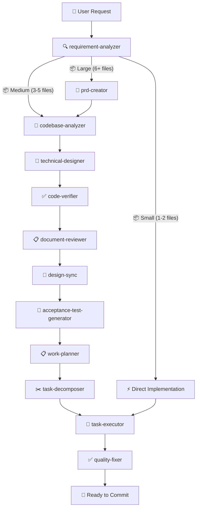
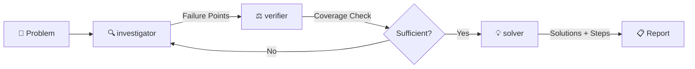
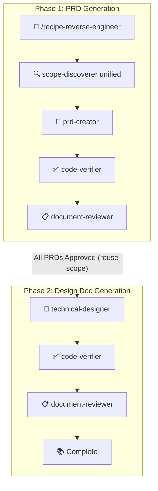

# Claude Code Workflows 🚀

[](https://claude.ai/code)
[](https://github.com/shinpr/claude-code-workflows)
[](https://opensource.org/licenses/MIT)
[](https://github.com/shinpr/claude-code-workflows/pulls)

**End-to-end development workflows for Claude Code** - Specialized agents handle requirements, design, implementation, and quality checks so you get reviewable code, not just generated code.

---

## ⚡ Quick Start

This marketplace includes the following plugins:

**Core plugins:**
- **dev-workflows** - Service/backend and general-purpose development
- **dev-workflows-frontend** - React/TypeScript specialized workflows
- **dev-workflows-dotnet** - .NET/C#/ASP.NET Core Web API/Azure specialized workflows
- **dev-workflows-blazor** - Blazor specialized workflows

**Optional add-ons** (enhance core plugins):
- **[claude-code-discover](https://github.com/shinpr/claude-code-discover)** - Turns feature ideas into evidence-backed PRDs
- **[metronome](https://github.com/shinpr/metronome)** - Detects shortcut-taking behavior and nudges Claude to proceed step by step
- **[linear-prism](https://github.com/shinpr/linear-prism)** - Turns requirements into structured Linear tasks — validates before decomposing, so downstream design starts clean

**Skills only** (for users with existing workflows):
- **dev-skills** - Coding best practices, testing principles, and design guidelines — no workflow recipes
- **dev-skills-dotnet** - .NET/Azure-oriented best practices and design guidance — no workflow recipes

These plugins provide end-to-end workflows for AI-assisted development. Choose what fits your project:

> **Plugin command naming:** Claude Code plugin commands are invoked with the plugin namespace. Examples: `/dev-workflows:recipe-implement`, `/dev-workflows-frontend:recipe-front-design`, `/dev-workflows-dotnet:recipe-implement`, `/dev-workflows-blazor:recipe-front-design`.

### Service / Backend or General Development

```bash
# 1. Start Claude Code
claude

# 2. Install the marketplace
/plugin marketplace add shinpr/claude-code-workflows

# 3. Install service/backend plugin
/plugin install dev-workflows@claude-code-workflows

# 4. Reload plugins
/reload-plugins

# 5. Start building
/dev-workflows:recipe-implement <your feature>
```

### Frontend Development (React/TypeScript)

```bash
# 1-2. Same as above (start Claude Code and add marketplace)

# 3. Install frontend plugin
/plugin install dev-workflows-frontend@claude-code-workflows

# 4-5. Same as above (reload plugins and start building)

# Use frontend-specific commands
/dev-workflows-frontend:recipe-front-design <your feature>
```

### .NET / ASP.NET Core / Azure Development

```bash
# 1-2. Same as above (start Claude Code and add marketplace)

# 3. Install .NET plugin
/plugin install dev-workflows-dotnet@claude-code-workflows

# 4. Reload plugins
/reload-plugins

# 5. Start building
/dev-workflows-dotnet:recipe-implement "Add an ASP.NET Core Web API endpoint with Azure integration"
```

### Blazor Development

```bash
# 1-2. Same as above (start Claude Code and add marketplace)

# 3. Install Blazor plugin
/plugin install dev-workflows-blazor@claude-code-workflows

# 4. Reload plugins
/reload-plugins

# 5. Start building
/dev-workflows-blazor:recipe-front-design "Add a Blazor page and component workflow"
```

### Full-Stack Development

Install the plugin pair that matches your stack to get the complete cross-layer toolkit.

```bash
# Existing web stack example
/dev-workflows:recipe-fullstack-implement "Add user authentication with JWT + React login form"

# .NET + Blazor example
/dev-workflows-dotnet:recipe-fullstack-implement "Add user authentication with JWT + Blazor login form"

# Or execute from existing fullstack work plan
/dev-workflows:recipe-fullstack-build
```

The fullstack recipes create separate Design Docs per layer (service/backend + UI/client), verify cross-layer consistency via design-sync, and route tasks to the appropriate executor based on filename patterns. See [Fullstack Workflow](#fullstack-workflow) for details.

### External Plugins

```bash
# Install discover (product discovery before implementation)
/plugin install discover@claude-code-workflows

# Install metronome (prevents shortcut-taking behavior)
/plugin install metronome@claude-code-workflows

# Install linear-prism (requirements → Linear tasks with quality gates)
/plugin install linear-prism@claude-code-workflows
```

### Skills Only (For Users with Existing Workflows)

If you already have your own orchestration (custom prompts, scripts, CI-driven loops) and just want the best-practice guides, use `dev-skills` or `dev-skills-dotnet`. If you want Claude to plan, execute, and verify end-to-end, install the workflow plugin that matches your stack instead.

- Minimal context footprint — no agents or recipe skills loaded
- Drop-in best practices without changing your workflow
- Works as a ruleset layer for your own orchestrator

> **Do not install alongside a workflow plugin from the same stack family** — duplicate skills will be silently ignored. See [details below](#warning-duplicate-skills).

```bash
# Install skills-only plugin
/plugin install dev-skills@claude-code-workflows

# Install .NET skills-only plugin
/plugin install dev-skills-dotnet@claude-code-workflows
```

Skills auto-load when relevant — `coding-principles` activates during implementation, `testing-principles` during test writing, etc.

**Switching between plugins:**

```bash
# dev-skills → dev-workflows
/plugin uninstall dev-skills@claude-code-workflows
/plugin install dev-workflows@claude-code-workflows

# dev-workflows → dev-skills
/plugin uninstall dev-workflows@claude-code-workflows
/plugin install dev-skills@claude-code-workflows
```

<a id="warning-duplicate-skills"></a>

> **Warning:** `dev-skills` overlaps with `dev-workflows` and `dev-workflows-frontend`, and `dev-skills-dotnet` overlaps with `dev-workflows-dotnet` and `dev-workflows-blazor`. Installing both a skills-only plugin and a workflow plugin from the same stack family duplicates skill descriptions in system context. Claude Code limits skill descriptions to about 2% of the context window, so duplicated skills may be silently ignored.

### Sync Into an Existing Local Marketplace

If you keep a personal local marketplace under `~/.claude`, this repo includes a sync script that vendors the repo-local plugins into that marketplace without installing them.

```bash
./scripts/sync-to-local-marketplace.sh
```

Defaults:
- Source repo: current checkout
- Target marketplace: `~/.claude/plugins/marketplaces/local-plugins`
- Synced plugins: `dev-workflows`, `dev-workflows-frontend`, `dev-workflows-dotnet`, `dev-workflows-blazor`, `dev-skills`, `dev-skills-dotnet`
- External Git-backed plugins are not copied

Optional flags:

```bash
./scripts/sync-to-local-marketplace.sh --dry-run
./scripts/sync-to-local-marketplace.sh --target ~/.claude/plugins/marketplaces/local-plugins
./scripts/sync-to-local-marketplace.sh --source /path/to/your/fork
```

The script updates the local marketplace manifest, preserves unrelated existing plugins, and prints install commands such as:

```text
/plugin install dev-workflows@local-plugins
```

---

## 🔧 How It Works

### The Workflow



### The Diagnosis Workflow



### The Reverse Engineering Workflow



### What Happens Behind the Scenes

1. **Analysis** - Figures out how complex your task is
2. **Codebase Understanding** - Analyzes existing code to inform design decisions
3. **Planning** - Creates the right docs (PRD, UI Spec, Design Doc, work plan) based on complexity
4. **Execution** - Specialized agents handle implementation autonomously
5. **Quality** - Runs tests, checks types, fixes errors automatically
6. **Review** - Makes sure everything matches the design
7. **Done** - Reviewed, tested, ready to commit

---

## ⚡ Workflow Recipes

All workflow entry points use the `recipe-` prefix to distinguish them from knowledge skills. Type `/recipe-` and use tab completion to see all available recipes.

### Service / Backend & General Development (dev-workflows)

| Recipe | Purpose | When to Use |
|--------|---------|-------------|
| `/recipe-implement` | End-to-end feature development | New features, complete workflows |
| `/recipe-fullstack-implement` | End-to-end fullstack development | Cross-layer features (requires matching service/backend + UI plugins) |
| `/recipe-task` | Execute single task with precision | Bug fixes, small changes |
| `/recipe-design` | Create design documentation | Architecture planning |
| `/recipe-plan` | Generate work plan from design | Planning phase |
| `/recipe-build` | Execute from existing task plan | Resume implementation |
| `/recipe-fullstack-build` | Execute fullstack task plan | Resume cross-layer implementation (requires matching service/backend + UI plugins) |
| `/recipe-review` | Verify code against design docs | Post-implementation check |
| `/recipe-diagnose` | Investigate problems and derive solutions | Bug investigation, root cause analysis |
| `/recipe-reverse-engineer` | Generate PRD/Design Docs from existing code | Legacy system documentation, codebase understanding |
| `/recipe-add-integration-tests` | Add integration/E2E tests to existing code | Test coverage for existing implementations |
| `/recipe-update-doc` | Update existing design documents with review | Spec changes, review feedback, document maintenance |

### Frontend Development (dev-workflows-frontend)

| Recipe | Purpose | When to Use |
|--------|---------|-------------|
| `/recipe-front-design` | Create UI Spec + UI/client Design Doc | React component architecture, UI Spec |
| `/recipe-front-plan` | Generate UI/client work plan | Component breakdown planning |
| `/recipe-front-build` | Execute UI/client task plan | Resume React implementation |
| `/recipe-front-review` | Verify code against design docs | Post-implementation check |
| `/recipe-task` | Execute single task with precision | Component fixes, small updates |
| `/recipe-diagnose` | Investigate problems and derive solutions | Bug investigation, root cause analysis |
| `/recipe-update-doc` | Update existing design documents with review | Spec changes, review feedback, document maintenance |

> **Tip**: The service/backend and UI-specialized plugins share `/recipe-task`, `/recipe-diagnose`, and `/recipe-update-doc`. `/recipe-update-doc` auto-detects the document's layer. If your project has UI/client Design Docs, the matching UI plugin is needed to update them. For reverse engineering, use `/recipe-reverse-engineer` with the fullstack option to generate both service/backend and UI/client Design Docs in a single workflow.

### .NET / Azure Development (dev-workflows-dotnet)

| Recipe | Purpose | When to Use |
|--------|---------|-------------|
| `/recipe-implement` | End-to-end feature development | ASP.NET Core APIs, background services, Azure integrations |
| `/recipe-task` | Execute single task with precision | Focused .NET changes, bug fixes, incremental work |
| `/recipe-design` | Create design documentation | API, integration, and architecture planning |
| `/recipe-plan` | Generate work plan from design | Implementation planning |
| `/recipe-build` | Execute from existing task plan | Resume .NET implementation |
| `/recipe-review` | Verify code against design docs | Post-implementation check |
| `/recipe-diagnose` | Investigate problems and derive solutions | Bug investigation, root cause analysis |
| `/recipe-reverse-engineer` | Generate PRD/Design Docs from existing code | Legacy system documentation, codebase understanding |
| `/recipe-add-integration-tests` | Add integration/E2E tests to existing code | Test coverage for existing implementations |
| `/recipe-update-doc` | Update existing design documents with review | Spec changes, review feedback, document maintenance |

### Blazor Development (dev-workflows-blazor)

| Recipe | Purpose | When to Use |
|--------|---------|-------------|
| `/recipe-front-design` | Create UI Spec + UI/client Design Doc | Blazor page and component architecture, UI Spec |
| `/recipe-front-plan` | Generate UI/client work plan | Blazor page/component breakdown planning |
| `/recipe-front-build` | Execute UI/client task plan | Resume Blazor implementation |
| `/recipe-front-review` | Verify code against design docs | Post-implementation check |
| `/recipe-task` | Execute single task with precision | Component fixes, small UI updates |
| `/recipe-diagnose` | Investigate problems and derive solutions | Bug investigation, root cause analysis |
| `/recipe-update-doc` | Update existing design documents with review | Spec changes, review feedback, document maintenance |

---

## 📦 Specialized Agents

The workflow uses specialized agents for each stage of the development lifecycle.

### Shared Agents (Available in Both Plugins)

These agents work the same way whether you're building a REST API or a UI application:

| Agent | What It Does |
|-------|--------------|
| **requirement-analyzer** | Figures out how complex your task is and picks the right workflow |
| **codebase-analyzer** | Analyzes existing codebase before design to produce focused guidance for technical-designer |
| **work-planner** | Breaks down design docs into actionable tasks |
| **task-decomposer** | Splits work into small, commit-ready chunks |
| **code-reviewer** | Checks your code against design docs to make sure nothing's missing |
| **document-reviewer** | Reviews single document quality, completeness, and rule compliance |
| **design-sync** | Verifies consistency across multiple Design Docs and detects conflicts |
| **investigator** | Maps execution paths, identifies failure points with causal chains for problem diagnosis |
| **verifier** | Validates failure points, checks path coverage using Devil's Advocate method |
| **solver** | Generates solutions with tradeoff analysis and implementation steps |
| **security-reviewer** | Reviews implementation for security compliance after all tasks complete |

### Service/Backend-Specific Agents (dev-workflows)

| Agent | What It Does |
|-------|--------------|
| **prd-creator** | Writes product requirement docs for complex features |
| **technical-designer** | Plans architecture and tech stack decisions |
| **scope-discoverer** | Discovers functional scope from codebase for reverse engineering |
| **code-verifier** | Validates consistency between documentation and code implementation |
| **acceptance-test-generator** | Creates E2E and integration test scaffolds from requirements |
| **integration-test-reviewer** | Reviews integration/E2E tests for skeleton compliance and quality |
| **task-executor** | Implements service/backend features with TDD |
| **quality-fixer** | Runs tests, fixes type errors, handles linting - everything quality-related |
| **rule-advisor** | Picks the best coding rules for your current task |

### Frontend-Specific Agents (dev-workflows-frontend)

| Agent | What It Does |
|-------|--------------|
| **prd-creator** | Writes product requirement docs for complex features |
| **ui-spec-designer** | Creates UI Specifications from PRD and optional prototype code |
| **technical-designer-frontend** | Plans React component architecture and state management |
| **task-executor-frontend** | Implements React components with Testing Library |
| **code-verifier** | Validates consistency between documentation and code implementation |
| **quality-fixer-frontend** | Handles React-specific tests, TypeScript checks, and builds |
| **rule-advisor** | Picks the best coding rules for your current task |
| **design-sync** | Verifies consistency across multiple Design Docs and detects conflicts |

### .NET-Specific Agents (dev-workflows-dotnet)

| Agent | What It Does |
|-------|--------------|
| **technical-designer** | Plans .NET, ASP.NET Core, and Azure-oriented architecture decisions |
| **acceptance-test-generator** | Creates .NET-oriented integration and E2E test scaffolds from requirements |
| **task-executor** | Implements C# and ASP.NET Core tasks using .NET-specific coding and testing defaults |
| **quality-fixer** | Runs .NET quality checks such as format, build, analyzers, and tests |
| **security-reviewer** | Reviews .NET and Azure implementations for auth, secrets, storage, and cloud-boundary risks |
| **rule-advisor** | Picks the best coding rules for your current task |

### Blazor-Specific Agents (dev-workflows-blazor)

| Agent | What It Does |
|-------|--------------|
| **ui-spec-designer** | Creates UI Specifications for Blazor pages and components |
| **technical-designer-frontend** | Plans Blazor component, layout, and interaction architecture |
| **task-executor-frontend** | Implements Blazor pages and components using Blazor-specific testing defaults |
| **quality-fixer-frontend** | Runs .NET build/test checks plus Blazor-specific UI quality verification |
| **rule-advisor** | Picks the best coding rules for your current task |
| **design-sync** | Verifies consistency across multiple Design Docs and detects conflicts |

---

## 📚 Built-in Best Practices

The service/backend plugin includes proven best practices that work with any language:

- **Coding Principles** - Code quality standards
- **Testing Principles** - TDD, coverage, test patterns
- **Implementation Approach** - Design decisions and trade-offs
- **Documentation Standards** - Clear, maintainable docs

These are loaded as skills and automatically applied by agents when relevant.

The frontend plugin has React and TypeScript-specific rules built in.

The `.NET` plugin family adds stack-specific skills:

- **C# Rules** - C#/.NET implementation defaults, async/cancellation, DI, and data-access guidance
- **.NET Testing Principles** - xUnit, WebApplicationFactory/TestServer, and Azure-facing test defaults
- **ASP.NET Core API Guide** - API shape, auth, validation, DI, OpenAPI, and observability guidance
- **Azure Architecture Guide** - App Service, Key Vault, Application Insights, Storage, Cosmos DB, Event Grid, and Entra ID/B2C defaults
- **.NET Build and Quality** - `dotnet format`, `dotnet build`, `dotnet test`, analyzer, and OpenAPI/build hygiene workflow

The Blazor plugin adds UI-specific skills:

- **Blazor Rules** - Razor component design, parameters, validation, lifecycle, auth-sensitive UI, and JS interop guidance
- **Blazor UI Guide** - Blazor-specific anti-patterns, debugging, design checks, and quality workflow
- **Blazor Test Implement** - bUnit, host-backed UI verification, and Playwright guidance for Blazor features

---

## 🚀 What These Plugins Do

Each phase runs in a fresh agent context, so quality doesn't degrade as the task grows:

- **Analyze** → requirement-analyzer determines scale and workflow
- **Design** → technical-designer (+ ui-spec-designer for UI-specialized plugins) produces testable specs with acceptance criteria
- **Plan** → work-planner schedules integration by value unit, not by layer — so each phase delivers a working vertical slice
- **Implement** → task-executor builds and tests each task, quality-fixer verifies before every commit
- **Verify** → acceptance criteria trace from design through test skeletons, so nothing is left implicit

The React plugin adds React-specific agents, and the Blazor plugin adds Blazor-specific UI agents and UI Spec generation from optional prototype code.

The new .NET plugin family now includes both backend and UI-specialized surfaces:
- `dev-workflows-dotnet` uses .NET-specific skills and backend agents for C#, ASP.NET Core Web API, and Azure-oriented work
- `dev-workflows-blazor` uses Blazor-specific UI skills and agent prompts for Razor component and page workflows
- `dev-skills-dotnet` is the skills-only companion for teams with their own orchestration

Within these plugins, the recipe commands keep the familiar names (`/recipe-implement`, `/recipe-front-design`, `/recipe-task`, etc.), but now dispatch to the `.NET` and `Blazor` plugin-specific subagent namespaces instead of the original web-focused ones.

### Why UI Spec Exists

Prototypes show what the UI looks like, but not how it behaves across states, errors, and API boundaries. The gaps surface during integration — each task works alone but the whole doesn't hold up.

UI Spec bridges this by capturing component states, interactions, and acceptance criteria from the prototype. These criteria trace into the Design Doc and test skeletons, and the work plan uses them to schedule integration by value unit rather than by layer. The result is that design decisions are verified by tests, and breakage is caught early.

---

## 🎯 Typical Workflows

### Service / Backend Feature Development

```bash
/recipe-implement "Add user authentication with JWT"

# What happens:
# 1. Analyzes your requirements
# 2. Creates design documents
# 3. Breaks down into tasks
# 4. Implements with TDD
# 5. Runs tests and fixes issues
# 6. Reviews against design docs
```

### Frontend Feature Development

```bash
/recipe-front-design "Build a user profile dashboard"

# What happens:
# 1. Analyzes requirements
# 2. Asks for prototype code (optional)
# 3. Creates UI Specification (screen structure, components, interactions)
# 4. Creates UI/client Design Doc (inherits UI Spec decisions)
#
# Then run:
/recipe-front-build

# This:
# 1. Implements components with Testing Library
# 2. Writes tests for each component
# 3. Handles TypeScript types
# 4. Fixes lint and build errors
```

### Fullstack Workflow

```bash
/recipe-fullstack-implement "Add user authentication with JWT + React login form"

# What happens:
# 1. Analyzes requirements (same as /recipe-implement)
# 2. Creates PRD covering the entire feature
# 3. Asks for prototype code, creates UI Specification
# 4. Creates separate Design Docs for service/backend AND UI/client
# 5. Verifies cross-layer consistency via design-sync
# 6. Creates work plan with vertical feature slices
# 7. Decomposes into layer-aware tasks (service/backend, UI/client, fullstack)
# 8. Routes each task to the appropriate executor
# 9. Runs layer-appropriate quality checks
# 10. Commits vertical slices for early integration
```

> **Requires the matching service/backend + UI plugin pair.** The fullstack recipes create separate Design Docs per layer and route tasks to service/backend or UI/client executors based on filename patterns (`*-backend-task-*`, `*-frontend-task-*`). For reverse engineering existing fullstack codebases, use `/recipe-reverse-engineer` with the fullstack option.

### Quick Fixes (Both Plugins)

```bash
/recipe-task "Fix validation error message"

# Direct implementation with quality checks
# Works the same in the service/backend and UI-specialized plugins
```

### Code Review

```bash
/recipe-review

# Checks your implementation against design docs
# Catches missing features or inconsistencies
```

### Problem Diagnosis (Both Plugins)

```bash
/recipe-diagnose "API returns 500 error on user login"

# What happens:
# 1. Investigator maps execution paths and identifies failure points
# 2. Verifier checks path coverage and validates each failure point
# 3. Re-investigates if coverage is insufficient (up to 2 iterations)
# 4. Solver generates solutions with tradeoff analysis
# 5. Presents actionable implementation steps
```

### Reverse Engineering

```bash
/recipe-reverse-engineer "src/auth module"

# What happens:
# 1. Discovers functional scope (user-value + technical) in a single pass
# 2. Generates PRD for each feature unit
# 3. Verifies PRD against actual code
# 4. Reviews and revises until consistent
# 5. Generates Design Docs with code verification
# 6. Produces complete documentation from existing code
#
# Fullstack option: generates both service/backend and UI/client Design Docs per feature unit
```

> If you're working with undocumented legacy code, these commands are designed to make it AI-friendly by generating PRD and design docs.
> For a quick walkthrough, see: [How I Made Legacy Code AI-Friendly with Auto-Generated Docs](https://dev.to/shinpr/how-i-made-legacy-code-ai-friendly-with-auto-generated-docs-4353)

---

## 📂 Repository Structure

```
claude-code-workflows/
├── .claude-plugin/
│   └── marketplace.json        # Manages the plugin catalog
│
├── agents/                     # Shared agents (symlinked by multiple plugins)
│   ├── codebase-analyzer.md     # Pre-design codebase analysis
│   ├── code-reviewer.md
│   ├── code-verifier.md        # Design verification & reverse engineering
│   ├── investigator.md         # Diagnosis workflow
│   ├── verifier.md             # Diagnosis workflow
│   ├── solver.md               # Diagnosis workflow
│   ├── scope-discoverer.md     # Reverse engineering workflow
│   ├── task-executor.md
│   ├── technical-designer.md
│   └── ...
│
├── skills/                     # Shared skills (knowledge + recipe workflows)
│   ├── recipe-implement/       # Workflow entry points (recipe-* prefix)
│   ├── recipe-design/
│   ├── recipe-diagnose/
│   ├── recipe-reverse-engineer/
│   ├── recipe-plan/
│   ├── recipe-build/
│   ├── ... (16 recipe skills total)
│
│   ├── ai-development-guide/   # Knowledge skills (auto-loaded by agents)
│   ├── coding-principles/
│   ├── testing-principles/
│   ├── implementation-approach/
│   ├── typescript-rules/       # Frontend-specific
│   └── ... (27 skills total: 16 recipes + 11 knowledge)
│
├── backend/                    # dev-workflows plugin
│   ├── agents/                 # Symlinks to shared agents
│   ├── skills/                 # Symlinks to shared skills
│   └── .claude-plugin/
│       └── plugin.json
│
├── frontend/                   # dev-workflows-frontend plugin
│   ├── agents/                 # Symlinks to shared agents
│   ├── skills/                 # Symlinks to shared skills
│   └── .claude-plugin/
│       └── plugin.json
│
├── dotnet/                     # dev-workflows-dotnet plugin
│   ├── agents/                 # .NET-specialized workflow assets
│   ├── skills/                 # .NET-specialized shared and recipe skills
│   └── .claude-plugin/
│       └── plugin.json
│
├── blazor/                     # dev-workflows-blazor plugin
│   ├── agents/                 # Blazor-specialized UI workflow assets
│   ├── skills/                 # Blazor-specialized UI skills
│   └── .claude-plugin/
│       └── plugin.json
│
├── skills-only/                # dev-skills plugin (knowledge skills only, no recipes/agents)
│   ├── skills/                 # Symlinks to shared knowledge skills (9 of 11 — workflow-specific skills excluded)
│   └── .claude-plugin/
│       └── plugin.json
│
├── skills-dotnet/              # dev-skills-dotnet plugin (knowledge skills only, no recipes/agents)
│   ├── skills/                 # .NET/Azure-specialized knowledge skills
│   └── .claude-plugin/
│       └── plugin.json
│
├── scripts/
│   └── validate-plugin-structure.sh  # Smoke-check plugin manifests and pointer files
│
├── LICENSE
└── README.md
```

---

## 🤔 FAQ

**Q: Which plugin should I install?**

A: Depends on what you're building:
- **APIs, services, CLI tools, or general programming** → Install `dev-workflows`
- **React apps** → Install `dev-workflows-frontend`
- **ASP.NET Core Web API, C#, or Azure-heavy backends** → Install `dev-workflows-dotnet`
- **Blazor apps** → Install `dev-workflows-blazor`
- **Full-stack projects** → Install the matching service/backend + UI pair

The matching plugin pairs can run side-by-side without conflicts.

**Q: Can I use multiple plugins at the same time?**

A: Yes. Install the pair that matches your stack. For example, use `dev-workflows` + `dev-workflows-frontend` for the existing web stack, or `dev-workflows-dotnet` + `dev-workflows-blazor` for the `.NET`/Blazor stack.

**Q: Do I need to learn special commands?**

A: Start with the namespaced plugin command. For example, use `/dev-workflows:recipe-implement` for backend-style plugins, `/dev-workflows-frontend:recipe-front-design` for React/TypeScript, `/dev-workflows-dotnet:recipe-implement` for .NET, and `/dev-workflows-blazor:recipe-front-design` for Blazor.

**Q: What if there are errors?**

A: The quality-fixer agents (one in each plugin) automatically fix most issues like test failures, type errors, and lint problems. If something can't be auto-fixed, you'll get clear guidance on what needs attention.

**Q: Is there a version for OpenAI Codex CLI?**

A: Yes! **[codex-workflows](https://github.com/shinpr/codex-workflows)** provides the same end-to-end development workflows for Codex CLI. Same concept — specialized subagents for requirements, design, implementation, and quality checks — adapted for the Codex CLI environment.

**Q: What's the difference between dev-skills and dev-workflows?**

A: `dev-skills` and `dev-skills-dotnet` provide only coding best practices as skills — no workflow recipes or agents. The `dev-workflows*` plugins include skills plus recipes and specialized agents for full orchestrated development. Use the skills-only variant if you already have your own orchestration and just want the knowledge guides. Do not install a skills-only plugin alongside the matching workflow plugin for the same stack family.

---

## 🔌 Contributing External Plugins

This marketplace supports the full lifecycle of building products with AI — from product quality and discovery through implementation control and verification. If your plugin helps developers build better products with AI coding agents, we'd like to hear from you.

See [CONTRIBUTING.md](CONTRIBUTING.md) for submission guidelines and acceptance criteria.

---

## 📄 License

MIT License - Free to use, modify, and distribute.

See [LICENSE](LICENSE) for full details.

---

Built and maintained by [@shinpr](https://github.com/shinpr).
